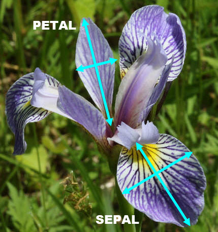
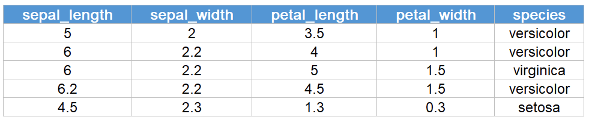

# Iris_dataset_Fisher
Project 2020 Programing and Scripting GMIT
  
## What is the Iris Flower Dataset 

The IRIS FLOWER DATA SET is a classic data set introduced by Ronald Fisher in 1930[1]. It is used in statistics methods and machine learning and consists of four continuous characters for three species of Iris: IRIS SETOSA, IRIS VERSICOLOR and IRIS VIRGINICA. This characters are SEPAL LENGTH, SEPAL WIDTH, PETAL LENGTH and PETAL WIDTH. It contains 150 objects of three different classes, with 50 numeric set values in cm for each class, which one is linearly separable from the other classes, while the other classes are not linearly separable from each other. This data set is available for download from UC Irvine Machine Learning Repository 

 

   

   Iris Virginica - Image from 2

 

   

Sample data from Iris dataset - Image from 3

  
# Why was this data collected

 

This information were collected by **Edgar Anderson** for his publication in 1936  as it seemed to be an ideal study case about genetic variation and test hypotheses of intra  morphological variation. Iris versicolor seems to be a mix between Iris virginica and iris setosa, which might indicate a case of hybridisation between these two species[8]

  

## Collection method

 

Iris setosa and Iris versicolor data were collected in the Gaspé Peninsula *"all from the same pasture, and picked on the same day and measured at the same time by the same person with the same apparatus"*  and then published by Edgar in 1935[  and  ]. The same method was certainly applied for Iris virginica before Edgar shared this data with the British statistician and biologist Ronald Aylmer Fisher in 1937 

  

## APPLICATIONS OF IRIS DATA SET: 

 

Due to the fact this data set is reasonably small, it makes it easy to be visualized and applied for learning of new analyses.  This data set is widely used as a beginner's dataset for machine learning purposes. It is also utilized in data mining , classification and clustering examples and to test algorithms. This is one of the most common and famous examples of Unsupervised Learning 

  

## REFERENCES
1. https://en.wikipedia.org/wiki/Ronald_Fisher
2. https://www.marylandbiodiversity.com/viewSpecies.php?species=357
3. https://towardsdatascience.com/neural-network-on-iris-data-4e99601a42c8

